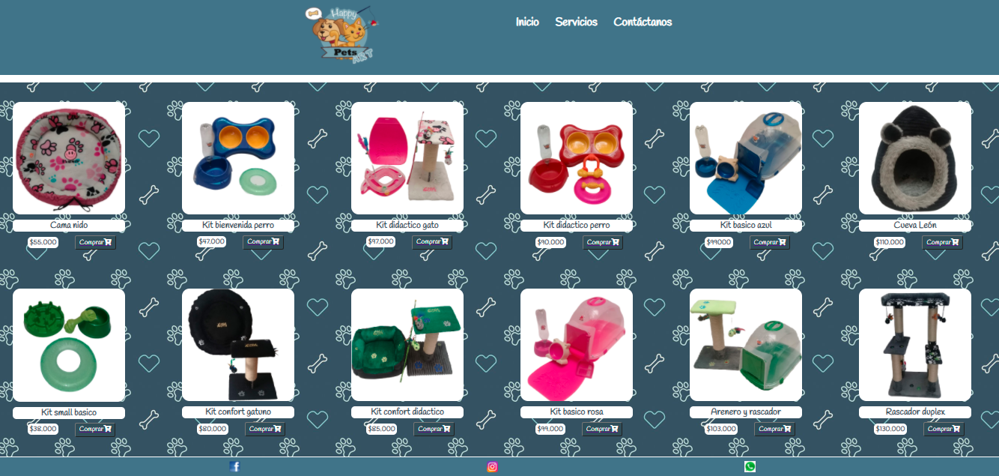
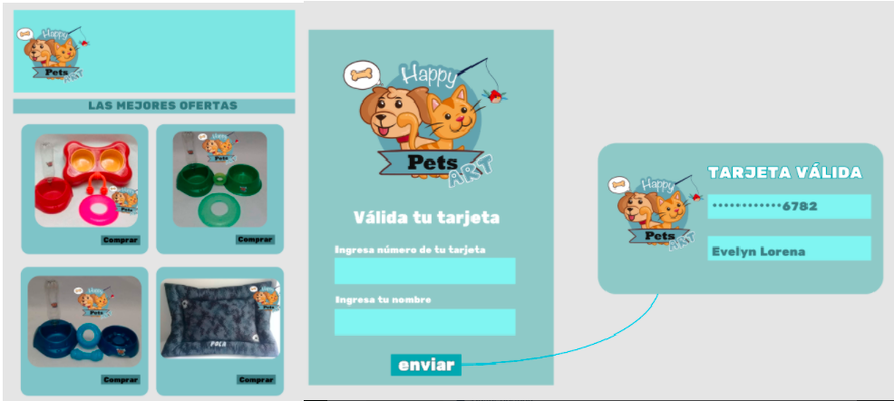

# HAPPY PETS ART- LA TIENDA PARA TU MASCOTA

## 1. RESUMEN DEL PROYECTO
Happy Pets Art, es una tienda online donde puedes encontrar gran variedad de productos, somos especialistas en gimnasios, rascadores, camas y accesorios para tu mascota.

# 2. Investigación UX:
## 2.1 ¿Quienes son nuestros usuarios y los objetivos en relación con el producto?

Propietarios de mascotas que tengan la capacidad de utilizar la internet, para comprar productos y accesorios relacionados con perros y gatos, desde la comodidad de su casa.

## 2.2 ¿cómo el producto soluciona los problemas/necesidades de usuario?

Los productos van dirigidos a propietarios de mascotas que deseen brindarle comodidad y diversión a su mascota. Facilitando el proceso de compra de forma sencilla y segura, donde se valida su tarjeta como método de pago.

## 2.3 Primer prototipo en papel.

## 2.4 Feedback recibido.
-Tener en cuenta la colorimetria para los botones y el formulario de ingreso de datos.
-Letra legible y visible, tanto en formulario de ingreso de datos como en la parte de la tarjeta.
-Distribución de espacios en la pagina web y en los botones.

## 2.5  Prototipo final.

# 3. OBJETIVOS DE APRENDIZAJE

## HTML y CSS
[x ] Uso de HTML semántico.
[x ] Uso de selectores de CSS.
[x ] Construir tu aplicación respetando el diseño realizado (maquetación).

## DOM
[x ] Uso de selectores del DOM.
[x ] Manejo de eventos del DOM.
[x ] Manipulación dinámica del DOM. (appendChild |createElement | createTextNode| innerHTML | textContent | etc.)

## JavaScript
[x ] Manipulación de strings.
[x ] Uso de condicionales (if-else | switch | operador ternario)
[x ] Uso de bucles (for | for..in | for..of | while)
[x ] Uso de funciones (parámetros | argumentos | valor de retorno)
[x ] Declaración correcta de variables (const & let)

## Testing
[x ] Testeo unitario.

## Estructura del código y guía de estilo
[x ] Organizar y dividir el código en módulos (Modularización)
[x ] Uso de identificadores descriptivos (Nomenclatura | Semántica)
[x ] Uso de linter (ESLINT)
## Git y GitHub
[x ] Uso de comandos de git (add | commit | pull | status | push)
[x ] Manejo de repositorios de GitHub (clone | fork | gh-pages)

## UX
[x ] Diseñar la aplicación pensando y entendiendo al usuario.
[x ] Crear prototipos para obtener feedback e iterar.
[x ] Aplicar los principios de diseño visual (contraste, alineación, jerarquía)

# 4. Herramientas de elaboración del proyecto
El proyecto fue elaborado con las herramientas HTML,JavaScript y CSS

# 5. Autores
Paula Lorena Ruiz
Evelyn Paola Botia

